---
date:
  created: 2024-11-22
  updated: 2024-11-24

search:
  exclude: true

slug: "/post1"
title: "Интерфейс для системы управления доступом"
metaTitle: "Интерфейс для системы управления доступом"
sort: "1"

---

## О проекте

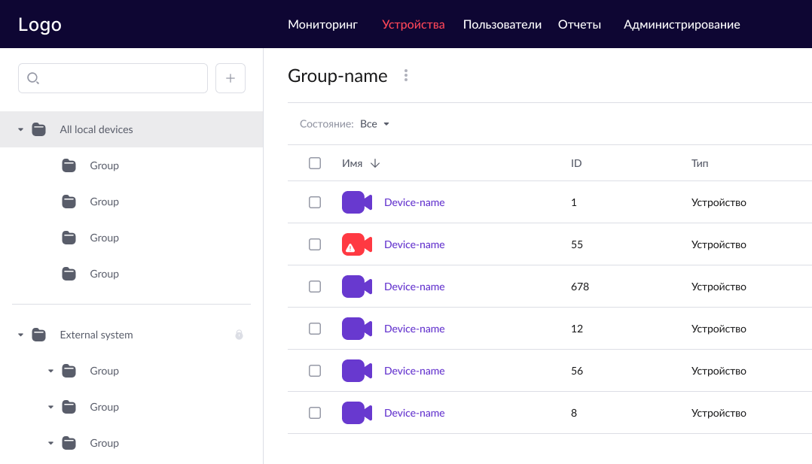

Компания, в которой я работала дизайнером, занималась разработкой собственных цифровых решений. Один из её продуктов — система видеонаблюдения.

В компанию обратился клиент с задачей автоматизировать пропускной режим на своем предприятии.

Основные цели:

- бесконтактный проход сотрудников через турникеты, бесконтактное измерение температуры,
- контроль рабочего времени и организация временных пропусков,
- интеграция с системой Sigur,
- аутентификация через Active Directory,
- формирование отчетности.  

Старый интерфейс не подходил под эти задачи и было принято решение полностью его переработать.  

### Формат продукта

Веб-сервис (без мобильной версии).

### Команда

- Дизайнер - я 👋
- Проджект-менеджер
- Аналитик
- Тимлид разработки
- ЛПР со стороны клиента

### Моя роль

- Исследовала продукт и конкурентов, выделила ключевые сценарии,
- Подготовила UI-kit и разработала прототипы основных сценариев,
- С нуля спроектировала новый интерфейс,
- Курировала реализацию макетов.

### Сложности, с которыми я столкнулась

1. **Сжатые сроки и отсутствие исследований**

    У нас не было времени на полноценные пользовательские интервью и тестирование. Мы опирались на аналитику конкурентов и собственный опыт. Это не заменило исследования, но позволило быстро собрать рабочую концепцию.

2. **Ограниченные ресурсы для дизайн-системы**

    Изначально я хотела предложить внедрить одну из существующих дизайн-систем, но быстро стало ясно, что для проекта с небольшим бюджетом и жёсткими сроками это неоправданно. Вместо этого я собрала локальный UI-kit с базовыми компонентами.

3. **Противоречивые ожидания стейкхолдеров**

    ЛПР часто ссылался на конкурентов и хотел «сделать как у них». Это экономило время, но не всегда подходило под наши процессы. Мне пришлось аргументировать: где заимствование действительно оправдано, а где лучше адаптировать или предложить своё решение.

4. **Навигация и вложенные группы**

    Структура с локальными и внешними группами, плюс возможность вложенности, угрожала перегрузить интерфейс. Я предложила несколько сценариев навигации. Вместе с командой мы обсудили варианты и выбрали комбинацию, которая сохранила масштабируемость и не запутывала пользователя.

5. **Отсутствие мобильной версии**

    Хотя мобильная адаптация в проекте не предусматривалась, нужно было учитывать, что интерфейсом будут пользоваться на разных экранах, включая небольшие экраны ноутбуков. Я отказалась от фиксированной ширины ячеек в таблицах и настроила их равномерное распределение. Это позволило сохранить читаемость данных даже при ограниченной ширине экрана.

## Подготовка

1. Я начала с изучения существующей версии продукта. Установила продукт и попробовала самостоятельно выполнить базовые сценарии.

    Вот так выглядел интерфейс приложения, которое требовалось доработать:

    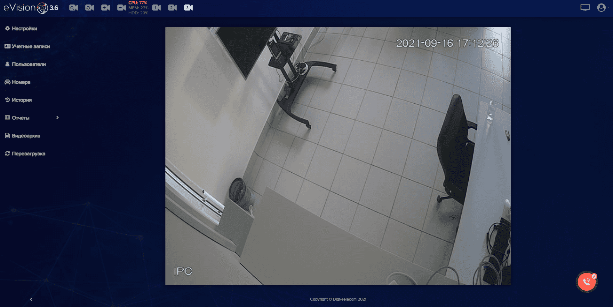

2. Составила карту функций и выделила сценарии по ролям.

    - [🔗 Карта функций в Figma](https://www.figma.com/board/tiIJ3Hv3RNT8f5jrfHiKxY/)  
    - [📊 Реестр сценариев](https://docs.google.com/spreadsheets/d/13eY5h-dG_va8fw0-JYh8TS8mpH_UEvt4yg3OH-H-CdU/)

3. Изучила конкурентов (частично через пробные версии, частично — по документации).

> 📌 Аналитикой пользователей на этом проекте я не занималась. Проджект-менеджер достаточно хорошо исследовал своих клиентов, я опиралась на его данные.

## Концептуальный макет

### Навигация

Я предложила построить навигацию из **двух уровней**, чтобы система оставалась масштабируемой и удобной при росте количества устройств и пользователей.

1. **Первый уровень** — выбор раздела.

    Основные разделы: **Устройства**, **Пользователи**, **Администрирование** и **Мониторинг**.

    Так как «Устройства» и «Пользователи» могут объединяться в группы, включая вложенные, необходимо было продумать удобный второй уровень навигации для работы с ними.

    На обсуждениях ЛПР ссылался на конкурентов, где навигация первого уровня размещена в верхней панели. Я учла этот опыт и подготовила два варианта:

    - с верхней панелью,
    - с боковой панелью слева.

    

    В конечном итоге ЛПР выбрал вариант **с верхней панелью**.

2. **Второй уровень** - выбор группы.

    В системе должны отображаться как локальные группы, созданные пользователями, так и внешние группы, загруженные из сторонних систем.

    Поскольку у нас не было возможности проводить исследования, мы с проджект-менеджером решили заимствовать опыт конкурентов. Навигацию второго уровня мы разместили в левой панели. Вместо сложных фильтров для локальных и внешних групп мы сделали **два отдельных иерархических дерева**.

    Чтобы пользователь не терял контекст при работе с вложенными группами, я добавила **хлебные крошки** перед табличной частью.

    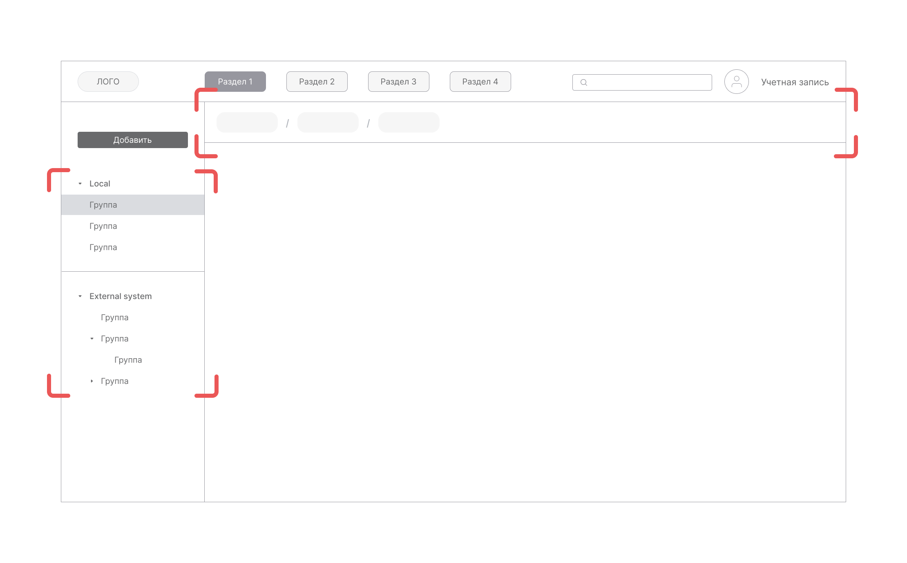

### Таблицы

Устройства и пользователи, сохраненные в группах, должны быть выведены в интерфейс в виде таблиц.

На этапе концептуального макета я не углублялась в проработку представления данных. Эта работа перенесена на следующий этап.

На этапе концептуального макета я сосредоточилась не на визуале, а на определении ключевых требований. Все решения согласовывала с проджект-менеджером и разработкой.

1. **Размещение**. На экране отображается одна таблица, занимающая всю ширину — это упрощает восприятие данных и даёт максимум пространства для работы.
2. **Фильтрация**. Я рассматривала 3 варианта размещения фильтрации:

    - фильтры в шапке таблицы (как в Excel),
    - скрытая панель по кнопке (по аналогии компонентом [“Table”](https://mui.com/material-ui/react-table/) из библиотеки Material UI v6),  
    - отдельная панель над таблицей.

    Остановились на третьем варианте: он оказался самым наглядным и не перегружал интерфейс.

3. **Пагинация или бесконечная прокрутка?** К решению этого вопросам был привлечен тимлид команды разработки. Мы остановились на “бесконечной прокрутке”.

    

### Форма просмотра и создания

1. Для **просмотра профиля устройства или пользователя** я рассматривала два варианта: модальное окно и отдельную страницу. Поскольку профили содержат сложные сценарии взаимодействия, включая вызов вложенных интерфейсов, я выбрала отдельную страницу.
2. **Формы создания объектов** я разбила на логические блоки и собрала их в виде пошагового мастера. Такой подход позволил сделать процесс добавления устройств, пользователей и групп последовательным. Как и в случае просмотра, мастер открывается на отдельной странице.

## Проработка внешнего вида

### UI-kit

Для проекта я подготовила локальный UI-kit для светлой темы.

Из-за небольшого масштаба проекта и сжатых сроков мы не могли тратить время на создание полноценной дизайн-системы. Я собрала ключевые компоненты интерфейса — кнопки, поля ввода, таблицы, модальные окна, вкладки и иконки — с использованием существующего стиля старой версии продукта. Это позволило сохранить узнаваемость продукта для пользователей и предоставить команде разработчиков готовые элементы для быстрой сборки экранов.

### Представление данных в таблицах

На этом этапе я прорабатывала представление данных в таблицах и действия с ними.

1. **Систематизация данных**.

    Я структурировала данные объектов и действия пользователя. Далее вместе с проджект-менеджером обсудила оптимальную структуру таблиц.

    

2. **Адаптивность**.

    Мы отказались от фиксированной ширины ячеек. Ячейки должны равномерно распределяться на экране. Текст в них должен отображаться без обрезания (если возможно) и переноса.

3. **Ячейки и строки**.

    - На этом шаге я прорабатывала компоненты для ячеек и строк.  
    - Проверяла гипотезу с “зеброй”. В некоторых гайдах по проектированию таблиц рекомендуют использовать чередующуюся заливку строк в виде “зебры”, чтобы сделать информацию лучше читаемой. Мы проговорили эту гипотезу с проджектом и в конечном итоге отбросили. В нашем случае “зебра” скорее отвлекала от чтения таблицы.

    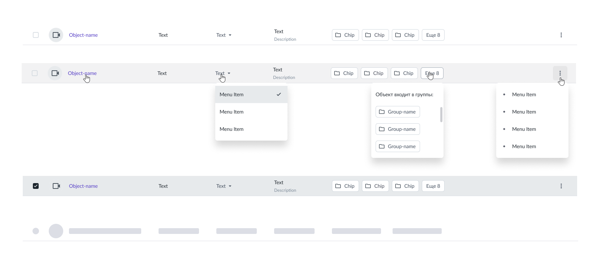

    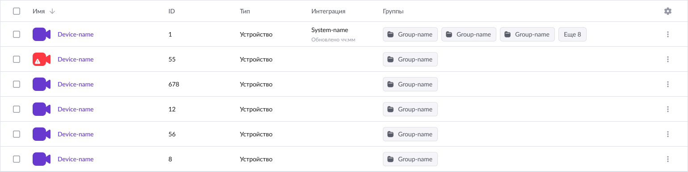

    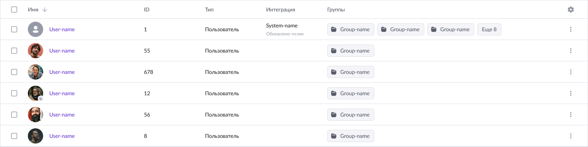

4. **Столбцы**.

    Было решено отказаться от регулятора ширины столбцов. Для упрощения просмотра мы добавили настройку отображения столбцов.

    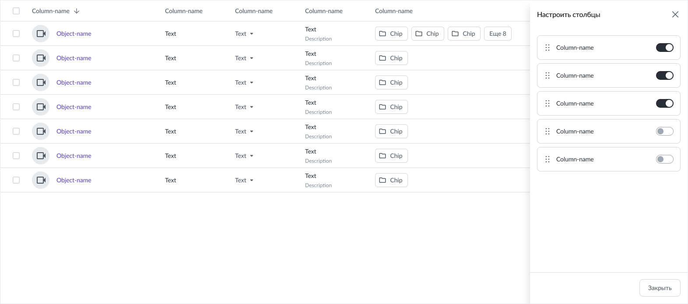

5. **Действия с элементами списка**.

    - Одиночные действия вынесли в виде привычного меню “Три точки”.

        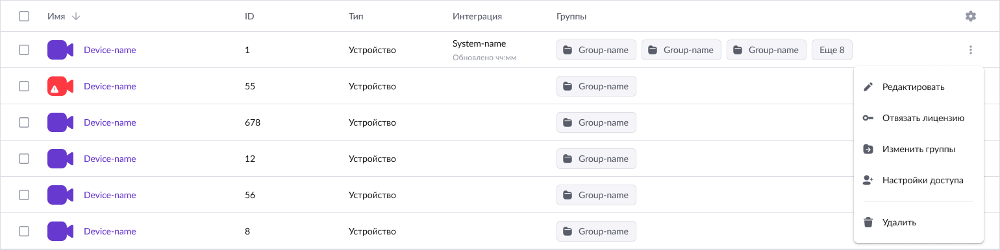

    - Групповые действия. Я выяснила, что пользователи редко обращаются к сценариям с групповыми действиями. Кроме того, групповые действия доступны не всем ролям в системе. Поэтому я предложила вызывать кнопки действий при проставлении отметки чекбоксом.  А для ролей, для которых эти действия недоступны, чекбоксы скрыть из интерфейса.

        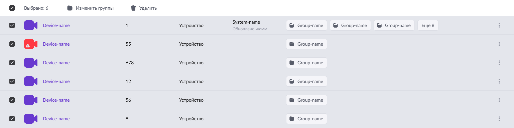

### Проработка форм

1. **Добавление устройства:** подключение → настройки устройства → настройки доступа

    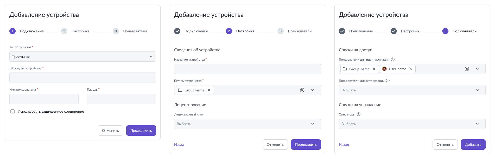

    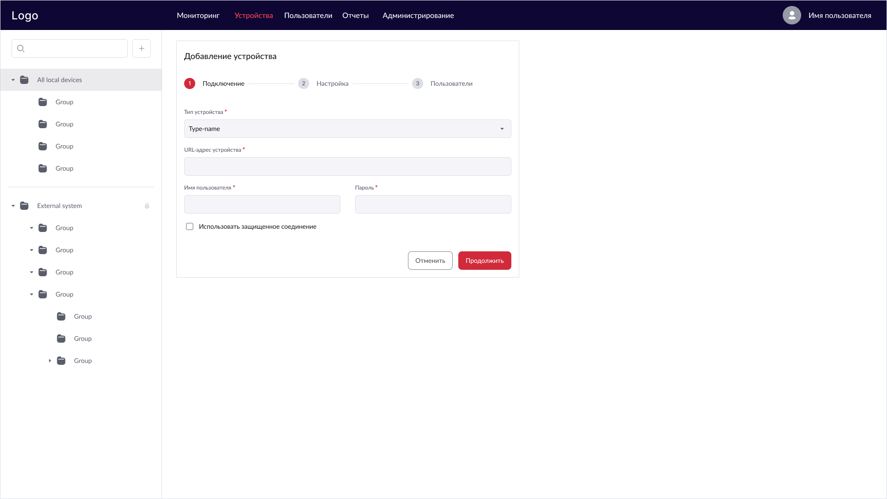

2. **Создание группы устройств:** сведения о группе → настройки доступа

    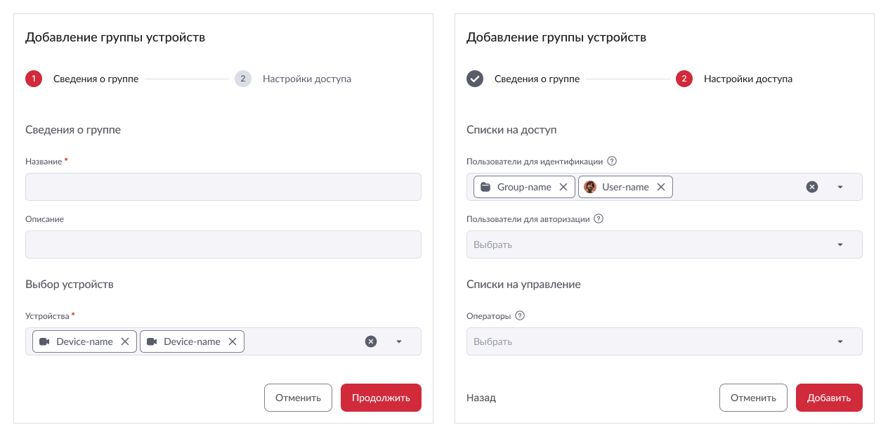

3. **Создание пользователя:** сведения → настройки доступа

    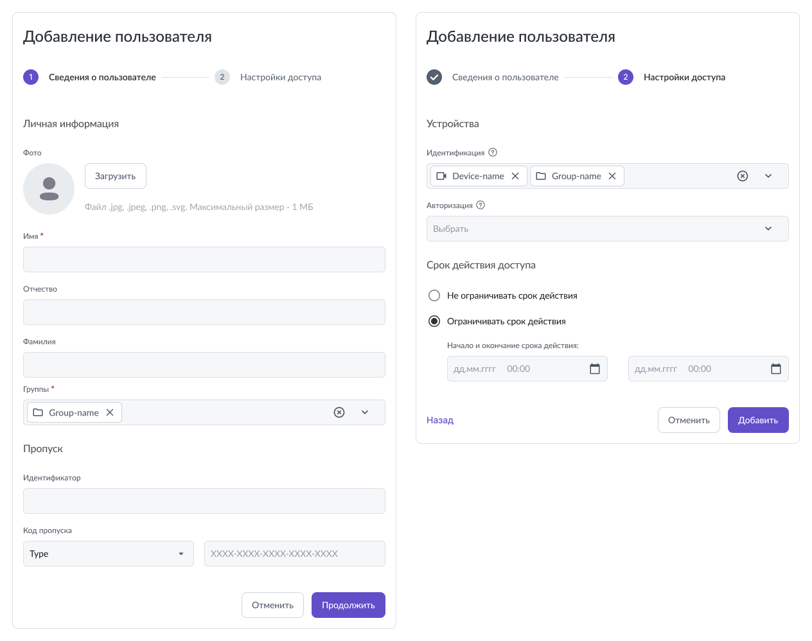

    В каждой форме я предусмотрела вызов вложенных форм в виде модальных окон. Внешний вид модальных я привела к одному шаблону.

    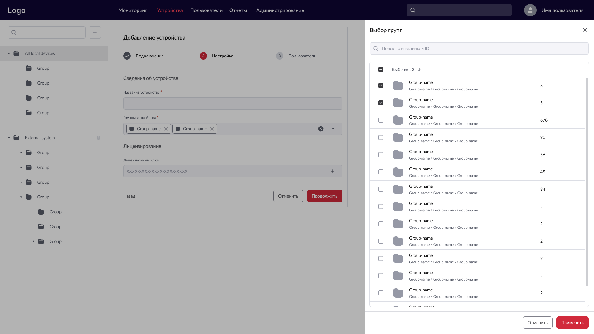

4. **Формы просмотра**: сведения об объекте → назначенные устройства для пользователей (а для устройств - пользователи )

    Для устройств:

    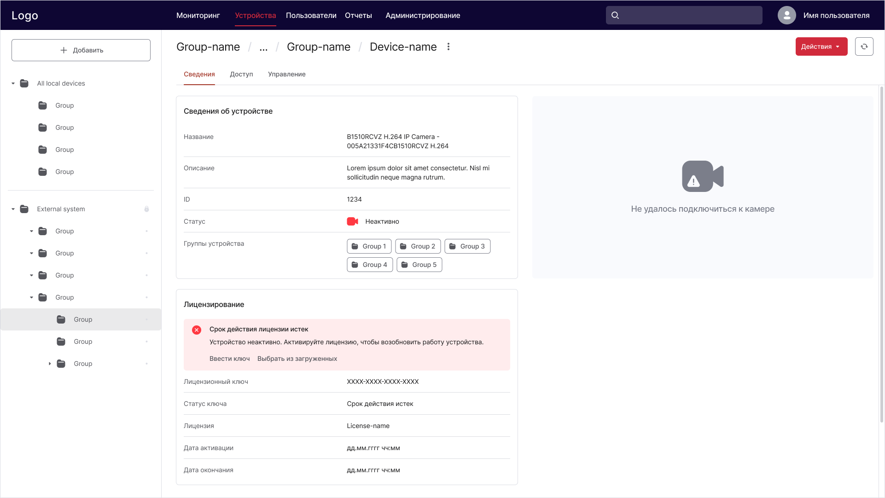

    Для пользователей:
  
    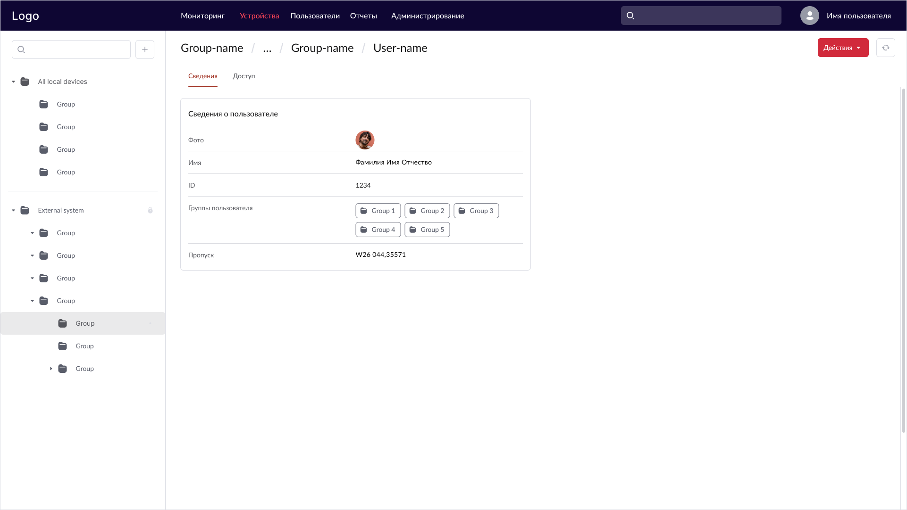

    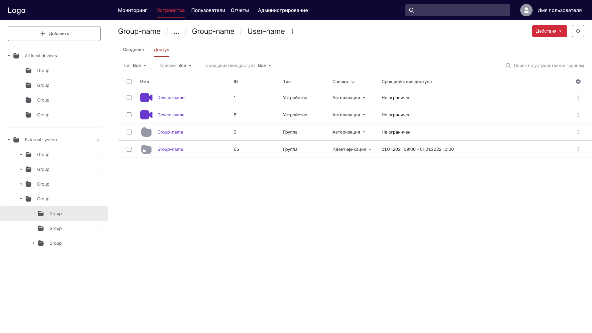

## Сдача проекта

К этому этапу я подготовила основные экраны приложения для разделов «Пользователи» и «Устройства», запрототипировала основные пользовательские сценарии.

Я провела демонстрацию команде и получила обратную связь от ЛПР. Требовалось доработать error-состояния, интерфейсные тексты и пустые состояния.

После доработки макеты ушли в разработку.

Далее мне предстояла работа над оставшимися разделами: «Отчеты», «Администрирование» и «Мониторинг».

## Результат

На начало 2022 года система успешно прошла все тесты и была внедрена на предприятии клиента. К системе были подключены терминалы доступа с поддержкой технологии распознавания лиц и обнаружением людей с повышенной температурой тела.
