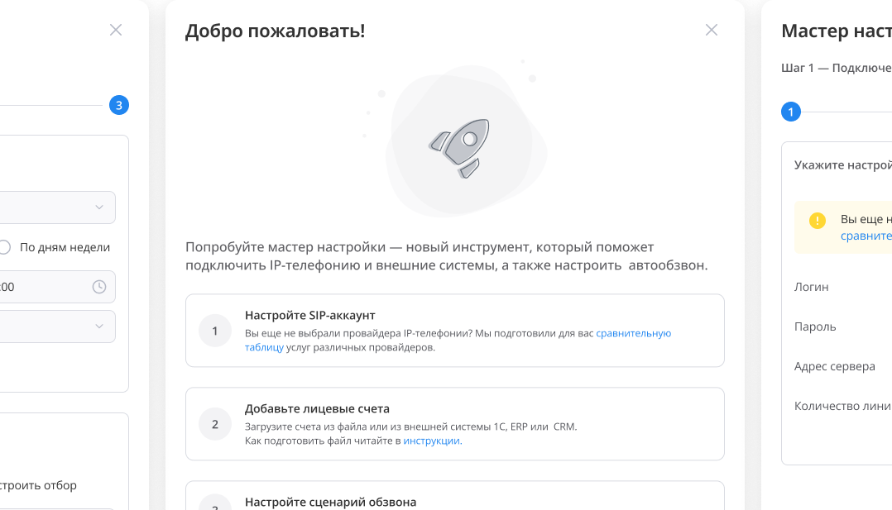

---
date:
  created: 2025-02-03
  updated: 2025-02-03

search:
  exclude: true

slug: "/post2"
title: "Приложение по обзвону должников"
metaTitle: "Приложение по обзвону должников"
sort: "2"

---

## О проекте

## Контекст

В компании, где я работала продуктовым дизайнером, создавалась облачная платформа для обработки голосовой информации. Она включала несколько приложений:

- Обзвон должников,
- Прием показаний счетчиков,
- Идентификация по телефону.

Моим основным проектом стал «Обзвон должников» — сервис для автоматического информирования клиентов о задолженностях.

Изначально интерфейс приложения делался «на скорую руку». Когда появились первые пользователи, стало очевидно, что продукту нужен редизайн.

Передо мной стояла задача улучшить UI приложения и, по возможности, UX.

### Формат продукта

Веб-сервис (без мобильной версии).

### Команда

- Я — дизайнер 🙋,
- Продакт-менеджер,
- Продукт-оунер (ЛПР).

### Моя роль

- Анализ пользовательского опыта,
- Предложение улучшений,
- Дизайн интерфейсов,
- Курировала реализацию макетов.

### Сложности, с которыми я столкнулась

1. **Нечёткие ожидания заказчика**

    На старте проекта заказчик хотел «улучшить интерфейс», но не сформулировал конкретных пожаланий. Я проводила анализ текущего сценария, выделяла проблемы и формировала список гипотез для обсуждения.

2. **Сложные настройки**

    В настройках обзвона и подключений было много технических параметров. Нужно было сделать их понятными для пользователя без ущерба для функциональности.

3. **Ограничения библиотеки**

    Мы использовали Material-UI, и радикально менять логику или стиль было нельзя. Приходилось придумывать решения внутри существующих паттернов и аккуратно их дорабатывать.

## Карта функций

Сначала я изучила документацию и составила карту функций всей платформы. Это помогло понять, какие блоки есть в каждом приложении:

* списки должников, счетчиков, систем,
* журнал звонков,
* управление балансом,
* профиль пользователя,
* настройки автообзвона,
* настройки подключений.

[🔗 Ссылка на карту функций](https://www.figma.com/board/XZyRXmhivU624MY72DALI2/02-case-%D0%BA%D0%B0%D1%80%D1%82%D0%B0-%D1%84%D1%83%D0%BD%D0%BA%D1%86%D0%B8%D0%B9?node-id=0-1&t=nnH3nSd13S0R7V7H-1)

## Карта пути пользователя

Затем я перешла к изучению пользовательского опыта. К сожалению, у меня не было возможности привлечь респондентов для проведения полноценных исследований. Поэтому я решила исследовать его самостоятельно, пройдя через основные шаги главного кейса использования.

### Первый вход

После первой авторизации открылся пустой раздел с лицевыми счетами и требованием пополнить баланс.

❌ Непонятно с чего начать работу. С пополнения баланса или загрузки лицевых счетов? Где искать настройки?

### Загрузка должников

Чтобы загрузить лицевые счета должников, я нажала на кнопку «Импорт(.xlsx)» и указала путь к файлу. Я загружала должников из тестового файла.

- 👍 Файл моментально загрузился. В разделе «Лицевые счета» отобразилась таблица со счетами должников.
- ❌ Неочевидно, как загрузить файл и где узнать о структуре.
- ❌ Таблица со счетами неинформативная. Отсутствует сортировка и глобальный поиск. Неудобная фильтрация.  
- ❌ Сумма и месяц задолженности объединены в один столбец.
- ❌ Нет возможности создать нового должника вручную.  

### Настройка сценария

Я настроила текст, который будет озвучивать робот во время звонка, а также определила критерии отбора должников.

- 👍 Я смогла прослушать предварительный результат звонка и смогла проверить какое количество должников попадет в обзвон в соответствии с указанными критериями.
- ❌ Как работает настройка «Месяца задолженности»? Следует ли понимать её как «более» или «менее»? По умолчанию в поле «Месяца задолженности» отображается какое-то странное значение.
- ❌ Как настроить обзвон по всем просроченным платежам?
- ❌ Как исключить из обзвона должников, которым уже ранее звонили?

### Настройка обзвона

- 👍 Я смогла установить дату и время, когда начнется и завершится обзвон. Также у меня была возможность выбрать другой голос, с которым робот будет зачитывать текст во время звонка.
- ❌ Если изменить голос, то придется возвращаться к настройкам сценария, чтобы заново прослушать предварительный звонок.

### Активация обзвона

Чтобы запустить обзвон, я нажала на кнопку «Активировать» в модальном окне с настройками.

После активации обзвона оставалось ощущение незавершенности.  

- ❌ Как понять, что обзвон активирован?
- ❌ Можно ли изменить настройки, когда запрос активирован?
- ❌ Как деактивировать запущенный обзвон?
- ❌ Как узнать результаты обзвона?

## Результаты анализа

На встречах с ЛПР мы обсудили итоги исследования и сценарии использования продукта.

В процессе анализа я выявила, что текущая архитектура ограничивает возможности масштабирования. В частности, пользователям было неудобно работать с большим количеством разнотипных данных внутри одного сценария.

В качестве решения я предложила ввести новую сущность — «Задание». Эта концепция позволяла бы:

- группировать загруженные счета в отдельные задания,
- задавать индивидуальные параметры обзвона и отбора,
- гибко управлять процессом (запускать, приостанавливать, деактивировать),
- отслеживать статус выполнения для каждого задания.

По сути, «Задание» могло стать единицей планирования и контроля, что облегчило бы масштабные операции и сделало систему более прозрачной.

Тем не менее, на том этапе мы приняли решение не менять архитектуру продукта радикально. Вместо этого команда сосредоточилась на улучшении UX/UI.

## Навигация

Навигация приложения должна состоять из нескольких уровней:

1. **Первый уровень** — выбор активного приложения:

    - Глобальное меню приложений,
    - Название активного приложения -  «Обзвон должников ЖКХ», «Прием показаний счетчиков» или «Идентификация по телефону»,
    - Учетная запись, с который выполнен вход.

    Стоит отметить, что для аутентификации пользователей на платформе был подключен сторонний сервис авторизации. После авторизации на платформе пользователь получал доступ ко всем ее приложениям.

2. **Второй уровень** - разделы приложения.

    - Список лицевых счетов должников,
    - Журнал звонков,
    - Настройки обзвона и подключений.

В конечном итоге я предложила два варианта:

- **Первый вариант**: Оставить существующую версию навигации.

    

- **Второй вариант**: вынести второй уровень навигации в боковое меню.

    

В итоге выбрали первый вариант, поскольку он использовался с самого начала и был привычен для имеющихся пользователей.

## Формы с настройками

Я разбила настройки приложения на два блока:

- Обзвон (время, критерии отбора, голосовые параметры, активация),
- Подключения (SIP-аккаунты и интеграции с внешними системами).

Для унификации интерфейса использовались компоненты из библиотеки Material-UI.

### Настройки обзвона

Я вынесла эту форму на отдельную страницу и учла недочеты, выявленные при построении пути пользователя.

- 👍 Настройки распределила по логическим блокам и убрала лишние аккордеоны. Первым расположила настройки обзвона (когда звонить), вторыми настройки отбора (кому звонить), далее — голосовые настройки (что говорить), последней настройку активации обзвона.
- 👍 Улучшила настройку отбора. Теперь пользовать может настроить обзвон по всем должникам из списка или может сумму и срок задолженности с условиями “более”, “менее”, “Более или равно” и “Менее или равно”.
- 👍 Активацию обзвона я вынесла в отдельный блок. В этом же блоке теперь отображается статус обзвона.
- 👍 Сделала последовательность шагов более прозрачной для пользователя.

### Настройки подключений

Подключения я собрала на отдельной вкладке «Подключения»:

- Вызов формы с созданием подключения сохранила в виде модального окна.
- Для каждого подключения добавила меню с действиями.

## Таблицы

Таблицы использовались в двух разделах — «Лицевые счета» и «Журнал звонков».

Я переработала их с упором на удобство чтения и работы с данными:

- 👍 Добавила в таблицу «пустое» состояние.

    

- 👍 Доработала сортировку.
- 👍 Убрала поиск из столбцов шапки таблицы. Вынесла его в отдельный компонент.
- 👍 Кнопки действий с элементами списка разместила на привычном месте над таблицей.
- 👍 Все количественные данные в таблицах выровняла по правому краю столбца.
- 👍Сумма и месяц задолженности в таблице с лицевыми счетами разнесла по разным столбцам.

Таблицы для раздела «Лицевые счета»:

Таблицы для раздела «Журнал»:

## Итог

В производство была внедрена только часть улучшений. Остальные изменения планировались по мере развития продукта и роста клиентской базы.

## Бонус «Мастер настройки»

Дополнительно для новых пользователей я разработала пошаговый мастер, который помогал пройти базовые этапы настройки. В нём я использовала уже существующие интерфейсные компоненты, чтобы сохранить единый стиль.

На момент описания кейса они ещё не были реализованы в продукте. Тем не менее, макеты полностью готовы к внедрению и могут быть переданы разработчикам для будущей реализации.

