---
date:
  created: 2025-02-03
  updated: 2025-02-03

#search:
  #exclude: true

slug: "/post2"
title: "Интерфейс приложения по обзвону должников"
metaTitle: "Интерфейс приложения по обзвону должников"
sort: "2"

glightbox.auto_caption: true

---

## Год

2022

## Что сделано

Обновлен интерфейс приложения «Обзвон должников».

## Контекст

Я работала продуктовым дизайнером в компании, которая создавала и внедряла собственные цифровые решения.

Одним из продуктов компании было приложение «Обзвон должников», предназначенное для информирования клиентов о накопившейся задолженности.

Приложение было частью облачной платформы по обработке голосовой информации. Помимо “Обзвона должников”, платформа включала в себя приложения “Прием показаний счетчиков” и “Идентификация по телефону”. Первоначально интерфейс приложения был разработан на скорую руку, но когда продукт получил первых пользователей, возникла необходимость в его доработке.

На первом этапе передо мной стояла задача улучшить UI приложения и, по возможности, UX приложения “Обзвон должников”.

## Формат

Веб-сервис без адаптации для мобильных устройств

## Команда

- Дизайнер - это я 🙋,
- Продакт-менеджер,
- Продукт-оунер (ЛПР).

## Предварительный анализ

На предварительных обсуждениях продакт-менеджер погрузил меня в продукт. Мне предоставили доступ к тестовой платформе, ссылку на портал с документацией и UI-kit, включающий палитру и стили шрифтов.

### Карта функций и аудит интерфейса

Я начала с изучения возможностей платформы. Ознакомилась с документацией и составила карту функций.

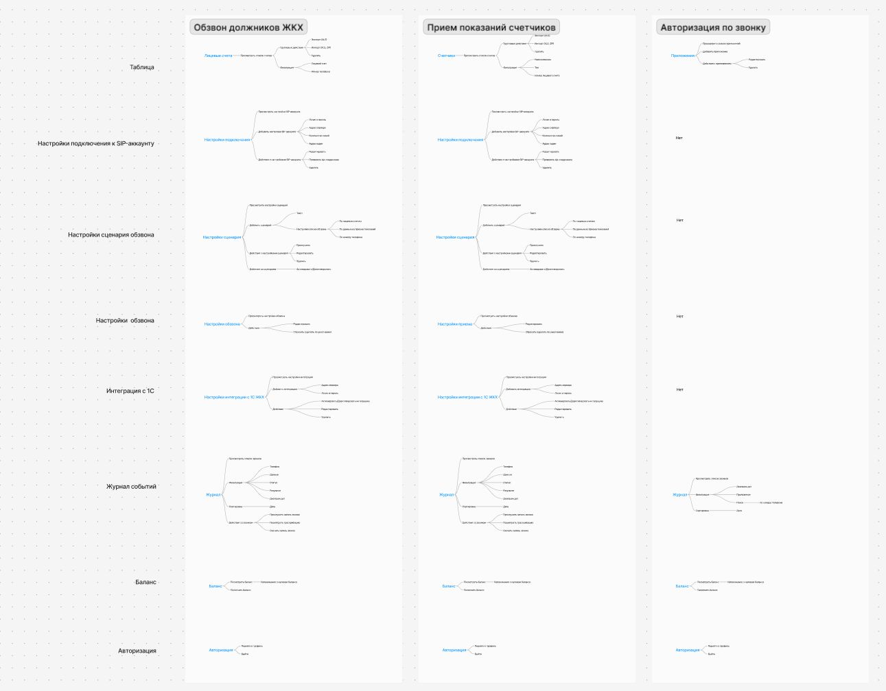

[Ссылка на карту функций](https://www.figma.com/board/XZyRXmhivU624MY72DALI2/02-case-%D0%BA%D0%B0%D1%80%D1%82%D0%B0-%D1%84%D1%83%D0%BD%D0%BA%D1%86%D0%B8%D0%B9?node-id=0-1&t=nnH3nSd13S0R7V7H-1)

Далее я разбила функциональность всех приложений на блоки, которые присутствуют в каждом из них:

- Списки должников, счетчиков, систем;
- Журнал звонков;
- Управление балансом;
- Профиль пользователя;
- Настройки автообзвона;
- Настройки подключений.

### Карта пути пользователя

Затем я перешла к изучению пользовательского опыта. К сожалению, у меня не было возможности привлечь респондентов для проведения полноценных исследований. Поэтому я решила исследовать его самостоятельно, пройдя через основные шаги главного кейса использования.

1. **Первый вход**.

    После прохождения первой авторизации открылся пустой раздел с лицевыми счетами и требованием пополнить баланс.

    ❌ Непонятно с чего начать работу. С пополнения баланса? Или загрузки лицевых счетов? Какие настройки доступны?

    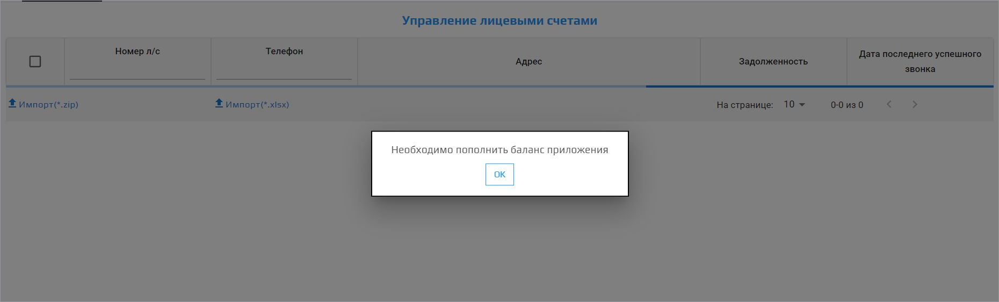

2. **Загрузка должников**.

    Чтобы загрузить лицевые счета должников, я нажала на кнопку «Импорт(.xlsx)» и указала путь к файлу. Я загружала должников из тестового файла.

    👍 Файл моментально загрузился. В разделе «Лицевые счета» отобразилась таблица со счетами должников.

    ❌ Неочевидно куда нажать, чтобы загрузить счета и непонятно, где ознакомиться с информацией о структуре файла.

    ❌ Таблица со счетами неинформативная. Отсутствует сортировка и глобальный поиск. Неудобная фильтрация.  

    ❌ Сумма и месяц задолженности объединены в один столбец.

    ❌ Нет возможности создать нового должника вручную.  

    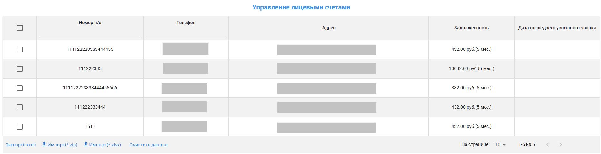

3. **Настройки**

    Интерфейс с настройками оформлен в виде модального окна и вызывается по кнопке из шапки таблицы. Настройки разбиты на категории, сгруппированные в аккордеоны.

    - **Настройка сценария**

        Я настроила текст, который будет озвучивать робот во время звонка, а также определила критерии отбора должников.

        👍 Я смогла прослушать предварительный результат звонка и смогла проверить какое количество должников попадет в обзвон в соответствии с указанными критериями.

        ❌ Как работает настройка «Месяца задолженности»? Следует ли понимать её как «более» или «менее»? По умолчанию в поле «Месяца задолженности» отображается какое-то странное значение.

        ❌Как настроить обзвон по всем просроченным платежам?

        ❌Как исключить из обзвона должников, которым уже ранее звонили?

        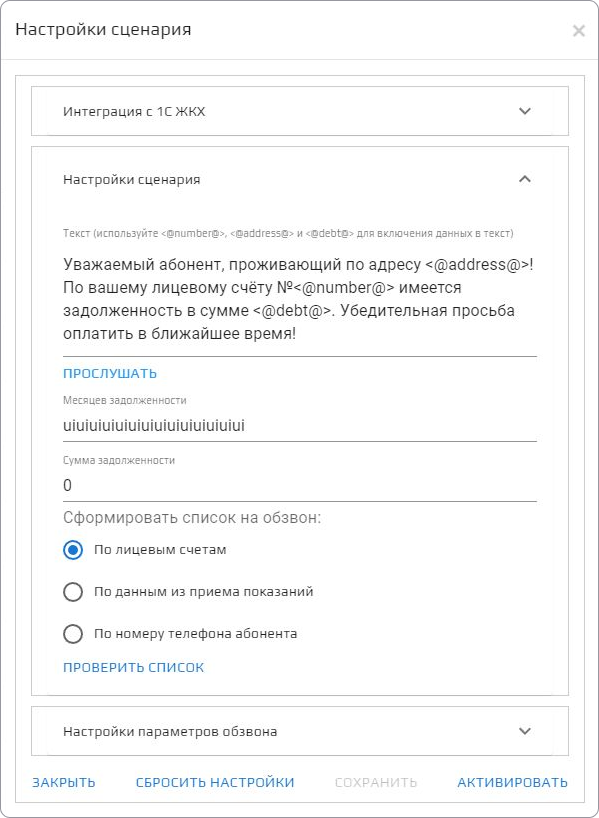

    - **Настройка обзвона**.

        👍 Я смогла установить дату и время, когда начнется и завершится обзвон. Также у меня была возможность выбрать другой голос, с которым робот будет зачитывать текст во время звонка.

        ❌ Если изменить голос, то придется возвращаться к настройкам сценария, чтобы заново прослушать предварительный звонок.

4. **Активация обзвона**.

    Чтобы запустить обзвон, я нажала на кнопку «Активировать» в модальном окне с настройками.

    После активации обзвона оставалось ощущение незавершенности.  

    ❌Как понять, что обзвон активирован?

    ❌Можно ли изменить настройки, когда запрос активирован?

    ❌Как деактивировать запущенный обзвон?

    ❌Как узнать результаты обзвона?

    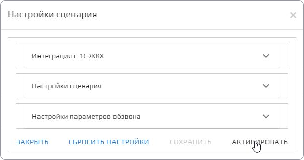

## Выводы

На обсуждениях с ЛПР мы проговорили результаты анализа.

Кроме того, я предложила рассмотреть новую функциональность с виртуальной сущностью "Задание". Благодаря этой функции, пользователь сможет загружать счета, настраивать параметры обзвона и отбора для конкретных заданий, активировать и деактивировать эти задания, а также отслеживать статус обзвона для каждого из них.

В конечном итоге было решено не вносить изменения в существующую функциональность. Мы решили сосредоточиться на первоначальном плане, который включал улучшение UX/UI приложения.

## Проектирование навигации

Навигация приложения должна состоять из нескольких уровней:

- **Первый уровень** - активное приложение.

    Первый уровень должен включать:

    - Возможность вызвать глобальное меню приложений,
    - Название активного приложения -  «Обзвон должников ЖКХ», «Прием показаний счетчиков» или «Идентификация по телефону»,
    - Учетную запись, с который выполнен вход.
    
    Стоит отметить, что для аутентификации пользователей на платформе был подключен сторонний сервис авторизации. После авторизации на платформе пользователь получал доступ ко всем ее приложениям.

- **Второй уровень** - активное приложение «Обзвон должников», которое должно включать следующие разделы:

    - Список должников,
    - Журнал звонков,
    - Настройки обзвона и подключений.

    Кроме того, нужно учесть интерфейс для управления балансом и учетной записью.

В конечном итоге я предложила два варианта:

1. **Первый вариант**: Оставить существующую версию навигации.

    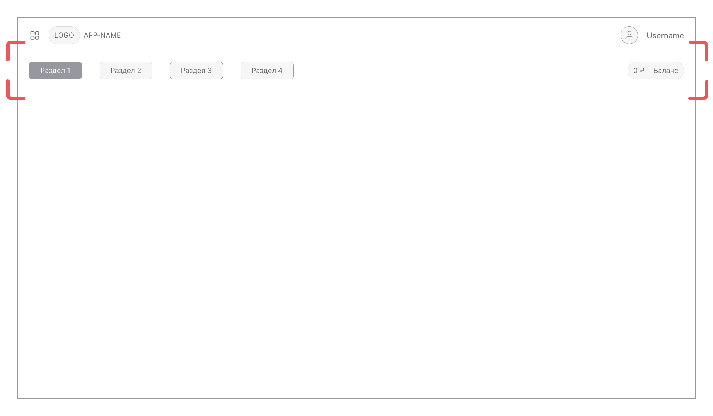

2. **Второй вариант**: вынести второй уровень навигации в боковое меню.

    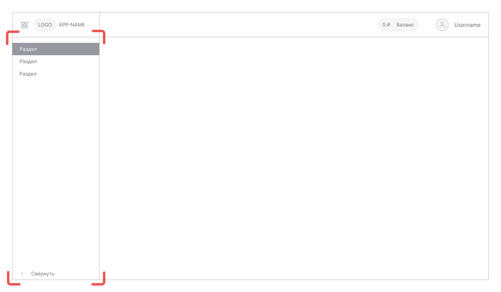

В результате победил первый вариант, поскольку он использовался с самого начала и был привычен для имеющихся пользователей.

## Проработка форм с настройками

Я разбила настройки приложения на два блока:

- Настройки обзвона,
- Настройки различных подключений.

Для всех форм использовала компоненты, существующие в библиотеке Material-UI.

### Настройки обзвона

Я решила разместить форму с настройками обзвона на новой странице. Основная причина — в этой форме много сложных настроек, и нет необходимости оставлять пользователя в контексте текущей страницы.

Я учла недочеты, выявленные при построении пути пользователя.

👍 Все настройки я рассортировала и разместила в виде блоков без сворачивания в аккордеоны. Первым расположила настройки обзвона (когда звонить), вторыми настройки отбора (кому звонить), далее — голосовые настройки (что говорить), последними настройку активации обзвона.

👍 Улучшила настройку отбора. Теперь пользовать может настроить обзвон по всем должникам из списка или может сумму и срок задолженности с условиями “более”, “менее”, “Более или равно” и “Менее или равно”.

👍 Принцип отбора стал понятнее. Пользователь может не только указать значение, но и настроить отбор по значению: «больше», «меньше», «больше или равно» и «меньше или равно».

👍 Активацию обзвона я вынесла в отдельный блок. В этом же блоке теперь отображается статус обзвона.

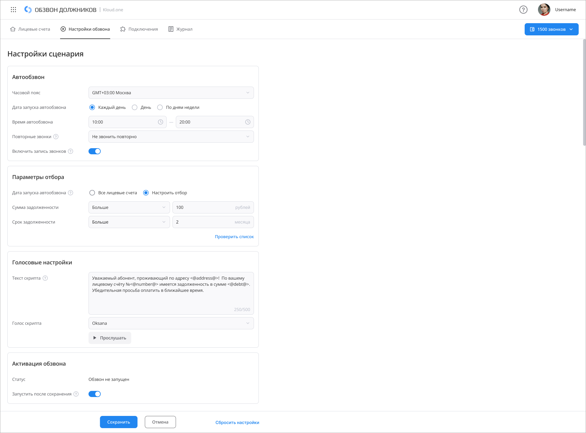

### Настройки подключений

Подключения к SIP-аккаунту и к внешним системам я разместила на одной вкладке “Подключения”.

Вызов формы с созданием подключения сохранила в виде модального окна.

Для каждого подключения добавила меню с действиями.

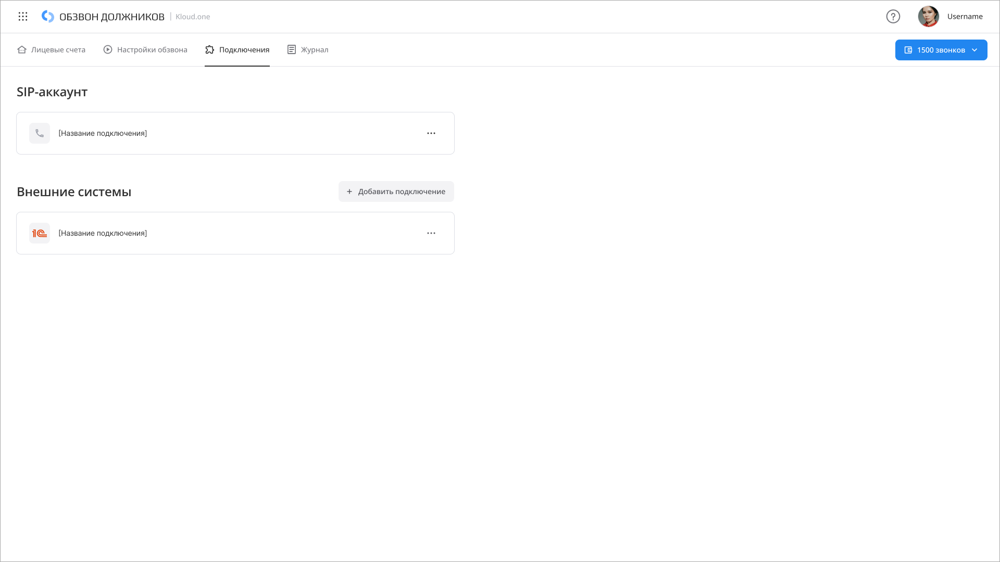

### Проработка таблиц

Таблицы отображаются в 2х разделах «Лицевые счета» и «Журнал».

👍 Добавила в таблицу «пустое» состояние.

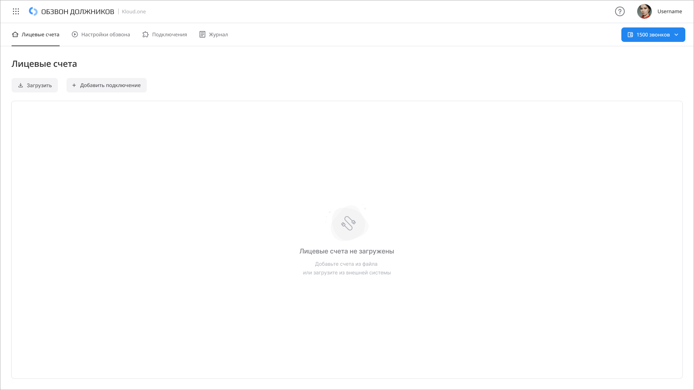

👍 Доработала сортировку.

👍 Убрала поиск из столбцов шапки таблицы. Вынесла его в отдельный компонент.

👍 Кнопки действий с элементами списка разместила на привычном месте над таблицей.

👍 Все количественные данные в таблицах выровняла по правому краю столбца.

👍Сумма и месяц задолженности в таблице с лицевыми счетами разнесла по разным столбцам.

Таблицы для раздела «Лицевые счета»:

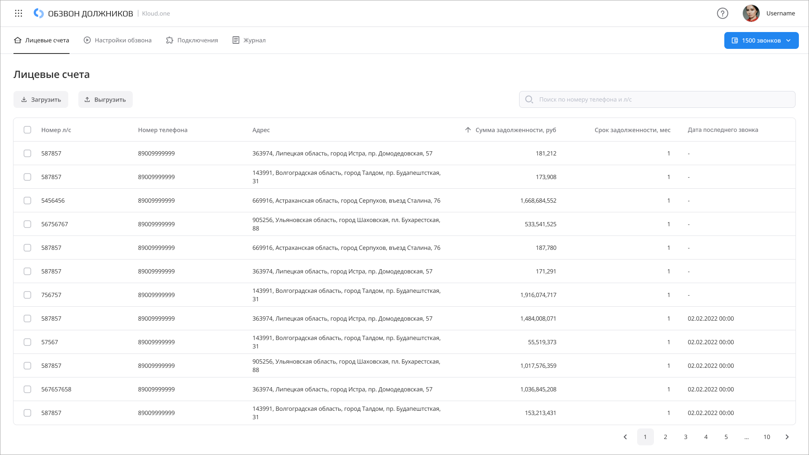

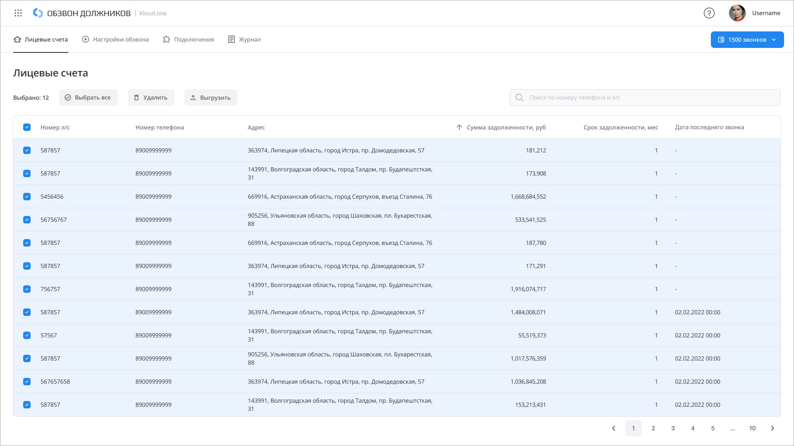

Таблицы для раздела «Журнал»:

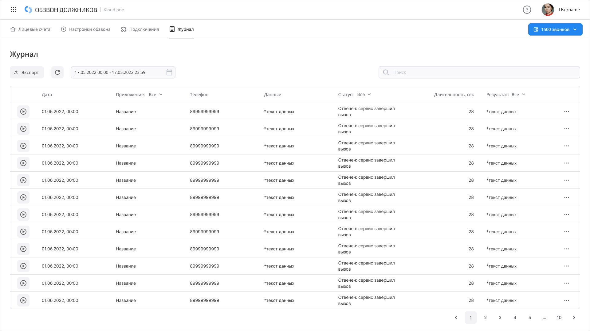

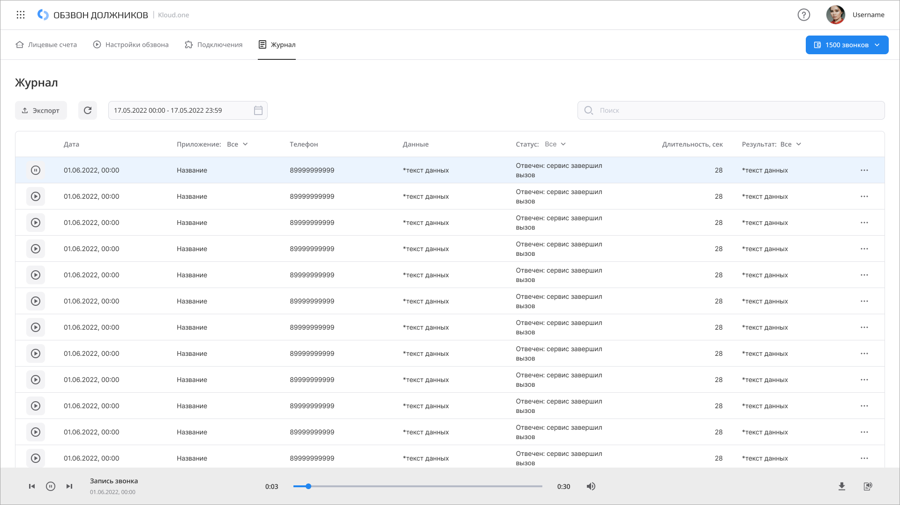

### Мастер настройки

Для новых пользователей я добавила пошаговый мастер настройки. В этом мастере я использовала компоненты, которые уже были в основных интерфейсах.

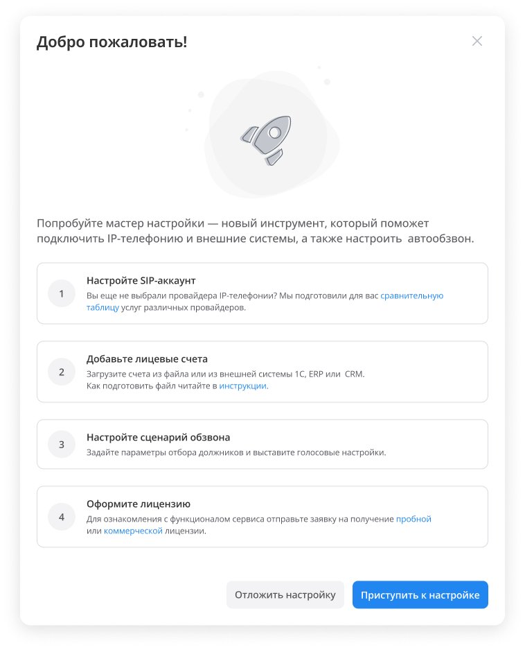

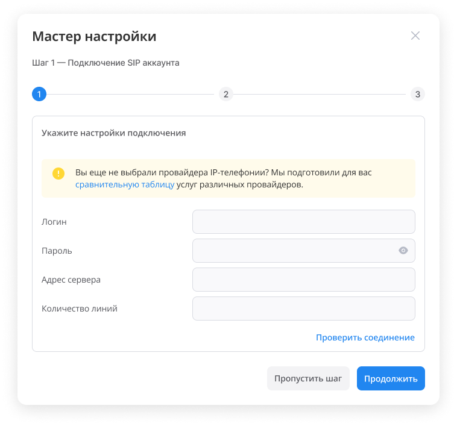

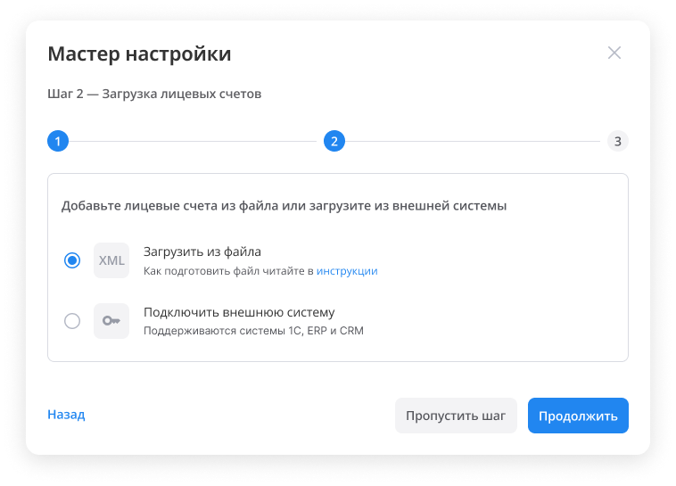

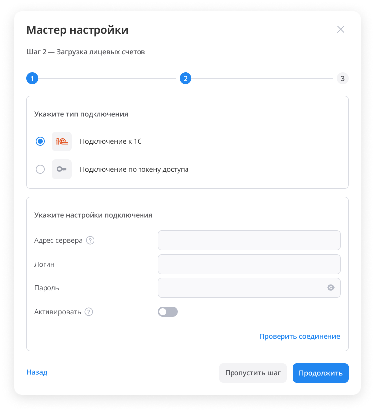

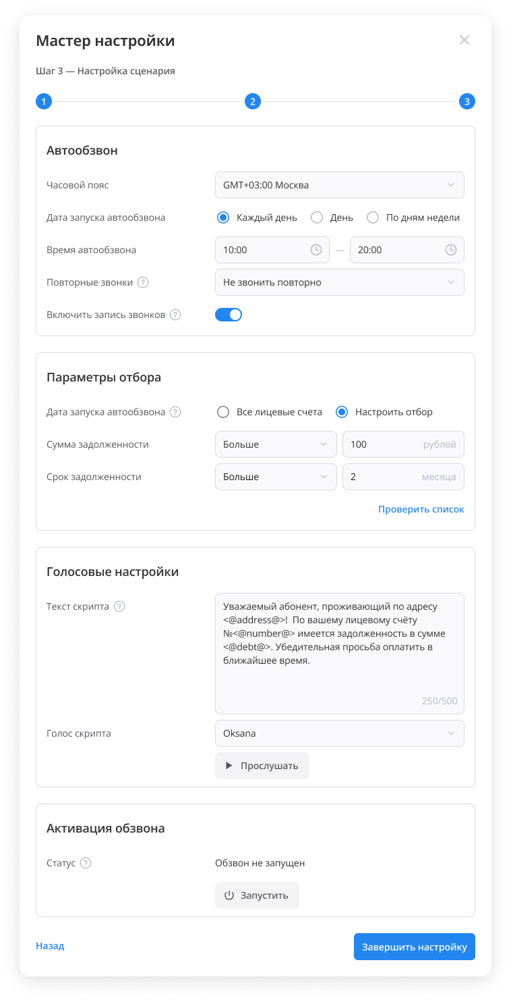

## Итог

В результате была внедрена лишь часть запланированных изменений, поскольку в настоящее время продукт продолжает развиваться и наращивает клиентскую базу.
