---
date:
  created: 2025-05-20
  updated: 2025-05-20

search:
  exclude: true

slug: "/post3"
title: "Приложение для подписи"
metaTitle: "Приложение для подписи"
sort: "3"

---

## О проекте

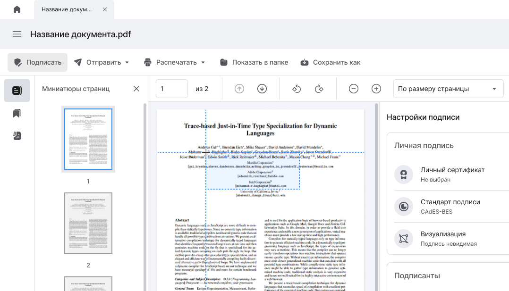

Я работала продуктовым дизайнером в компании, которая разрабатывала собственные цифровые решения.

К нам обратился заказчик с задачей разработать приложение для электронной подписи документов в формате PDF.  

На момент обращения клиент использовал приложение от западного вендора, но в рамках программы импортозамещения потребовался переход на отечественное решение.

Для этого мы адаптировали существующее приложение для подписания документов, добавив необходимую функциональность.

### Формат

Десктоп-приложение

### Команда

- Дизайнер - я 🙋,
- Системный аналитик,
- Ответственное лицо со стороны заказчика,
- Тимлид команды разработки.

### Моя роль

- Погрузилась в специфику электронных подписей PDF (PAdES) и изучила конкурентов.
- Участвовала в написании функциональных требований.
- Спроектировала интерфейсы просмотра, разметки, подписания и проверки документов.
- Предложила удобные паттерны взаимодействия, знакомые пользователям других PDF-приложений.
- Обеспечила визуальную консистентность с существующей дизайн-системой.
- Курировала реализацию макетов, отвечала на вопросы команды разработчиков и уточняла поведение интерфейсов.
- Участвовала в тестировании и подготовке 330 тест-кейсов, проверяя корректность и удобство всех сценариев.

### Сложности, с которыми я столкнулась

* **Новый опыт в написании функциональных требований**. Это был мой первый проект, где мне пришлось заниматься написанием функциональных требований и юз-кейсов для сложного модуля системы.
* **Неочевидная предметная область.** Несмотря на опыт в электронных подписях, с форматом PAdES я работала впервые. Пришлось быстро погрузиться в технические детали: разобраться, как именно встраивается подпись в PDF и чем отличаются видимые и невидимые подписи.
* **Ограничения готового продукта.** Так как приложение разрабатывалось на базе существующей системы, я не могла свободно придумывать паттерны — нужно было вписать новые сценарии в уже готовый каркас.
* **Сжатые сроки.** Нужно было быстро запустить рабочее решение. Поэтому я уделяла особое внимание приоритизации сценариев и использованию готовых компонентов.

---

## Подготовка требований

Когда я приступила к проекту, я уже была знакома с темой электронной подписи. Я владела терминологией и имела представление о приложениях, представленных на отечественном рынке. Но с подписанием PDF-документов я столкнулась впервые.

Клиенту требовался формат подписи PAdES. Проще говоря, формат подписи PAdES - формат, при котором подпись встраивается в PDF-документ. Подписанные PDF-документы сохраняют свое расширение. Подпись может быть видимой, т.е. отображаться на странице документа в виде штампа, и невидимой, не имеющей визуального представления.

1. **Изучение предметной области и конкурентов**

    Я начала с изучения предметной области. Изучила википедию и всевозможные русскоязычные ресурсы по тематике подписи, сертификации и конвертации PDF-документов.

    Совместно с аналитиком выделили трёх конкурентов и проанализировали их сценарии — этого хватило, чтобы понять рынок и уточнить требования заказчика.

2. **Сбор функциональных требований**

    Далее я совместно с аналитиком написала функциональные требования. Мы выделили ключевые сценарии использования, основные и альтернативные потоки, а также ограничения и возможности системы. Требования описывали все аспекты работы с документами: от их открытия и просмотра до подписания.

    [🔗 Ссылка на документ с требованиями](https://docs.google.com/document/d/1m5Wz53y-zje-dOc7Bi0q9KfxMS68CsZ_9UIyN4iY2bM/edit?usp=sharing)

---

## Проектирование интерфейса

В процессе проектирования я использовала существующую дизайн-систему компании, адаптировав ее под новые задачи.

Приложение включало базовые компоненты, такие как:

- Панель с вкладками. По аналогии с браузером в приложении можно было открыть несколько вкладок.
- Хедер с кнопкой главного меню и заголовком.
- Панель с кнопками доступных действий.
- Контентную часть.

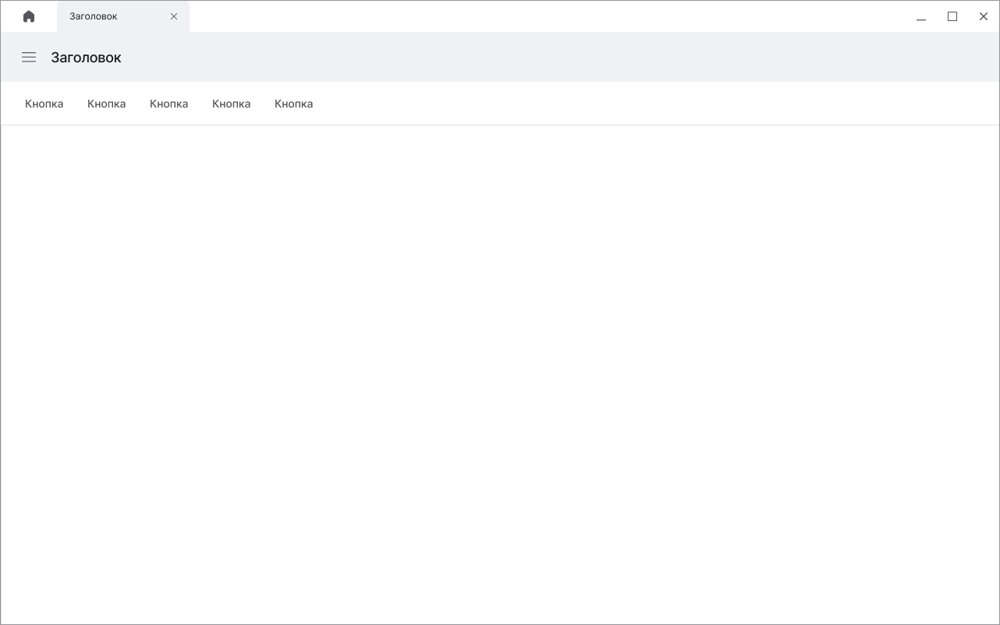

В этот каркас мне нужно было добавить компоненты для управления просмотрам и настройками подписи.

### Просмотр документа

Для сценариев, связанных с просмотром документа, я выделила несколько основных действий, которые пользователи будут выполнять в процессе работы с документом.

1. Действия с документом я вынесла на отдельную **панель действий**.
2. Миниатюры страниц, подписи, закладки, вложения я разместила в левом боковом меню.

    > 📌 Этот компонент часто применяется в других приложениях для просмотра PDF-документов и знаком пользователям.

3. Кнопки управления просмотром я разместила над областью с отображением страниц.
4. Добавила специальную кнопку, с помощью которой можно скрыть заголовок и панель действий.

Что получилось в конечном итоге:

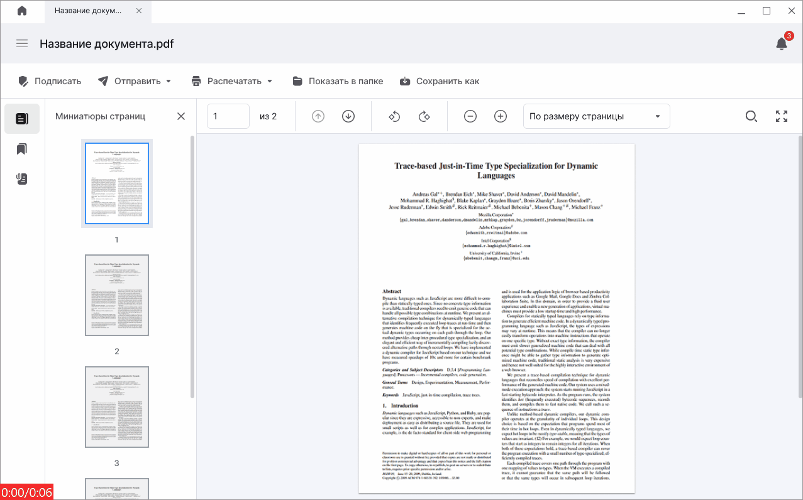

### Разметка и подпись

В этом интерфейсе пользователь должен иметь возможность выполнять все сценарии, связанные с разметкой и подписью.

1. Интерфейс открывается по кнопке **Подписать**. Когда пользователь нажимает на эту кнопку, появляется боковая панель с настройками разметки и подписи.

    > 📌 Настройки выставляются в соответствии с шаблоном, который задается в настройках приложения.

    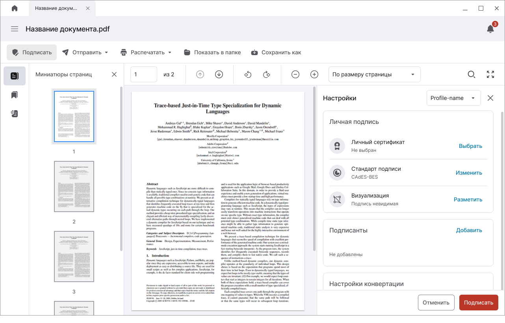

2. Пользователь может вручную выделять области для штампов прямо на странице.

    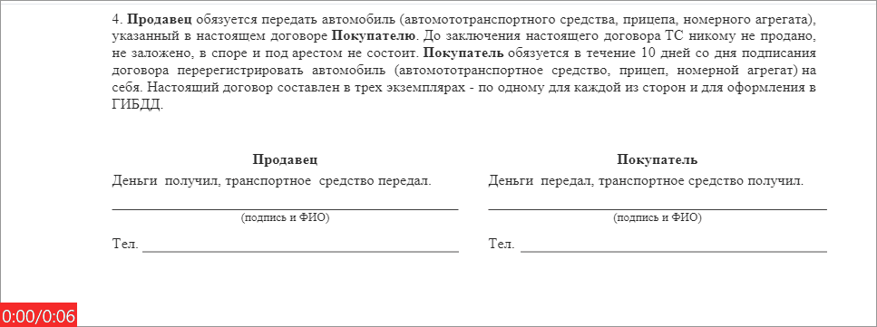

3. После разметки в область подставляется превью штампа. Настройки положения и внешнего вида штампа также доступны в боковом окне.

    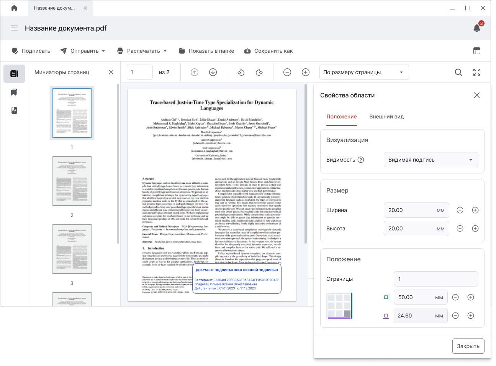

    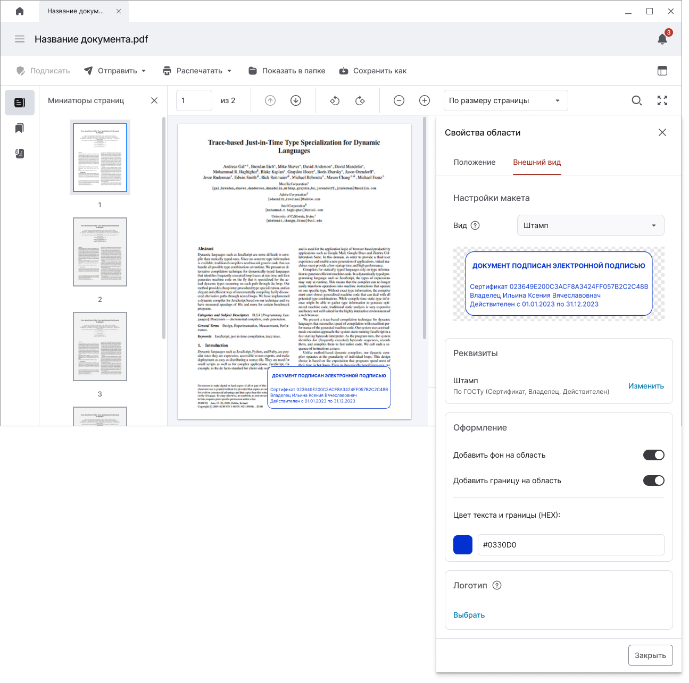

### Проверка подписи

При открытии документа запускается автоматическая проверка подписи:

1. Общий статус подписи отображается на специальном информере. Статусы каждой из подписей отображаются в левом боковом меню.

    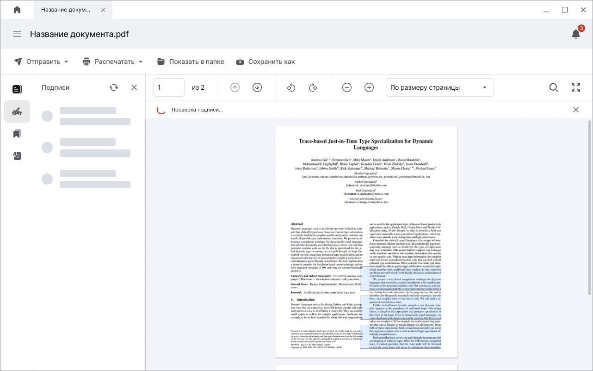

    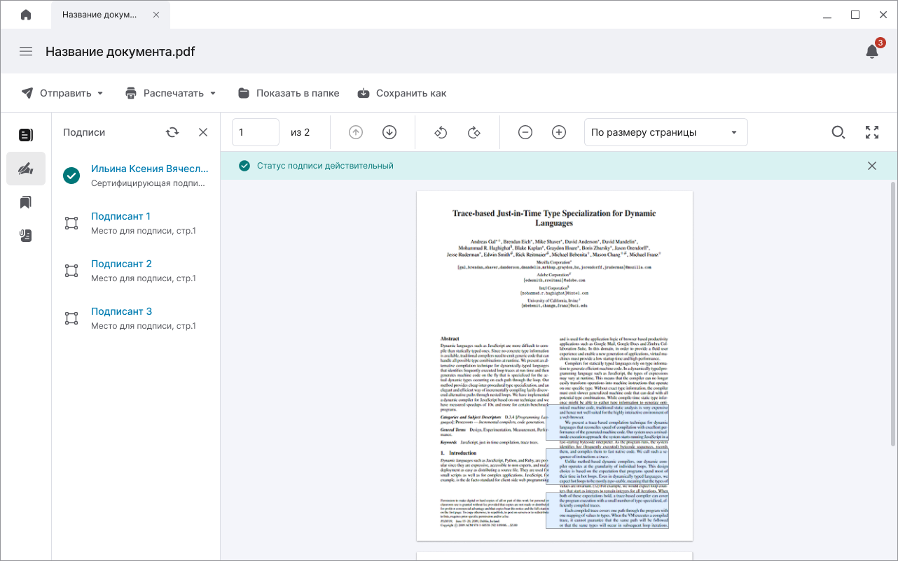

2. Чтобы открыть сведения о подписи нужно нажать на имя подписанта в боковом меню или на штамп на странице документа.

    Сведения открываются в боковой панели справа.

    

### Подпись в размеченную область

Чтобы поставить подпись в существующую область, нужно нажать на название области в боковом меню или на саму область на странице документа.

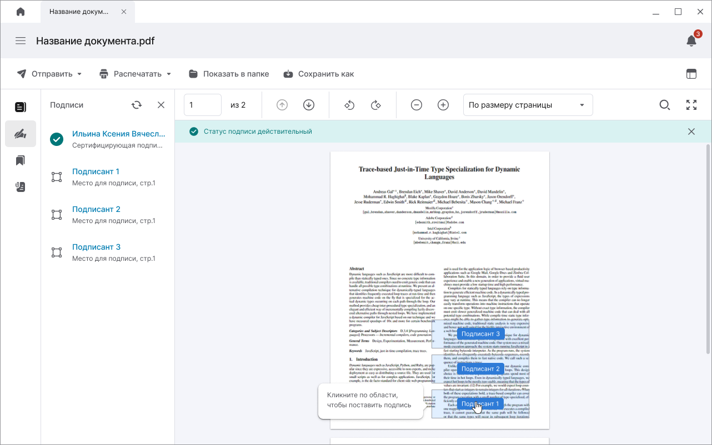

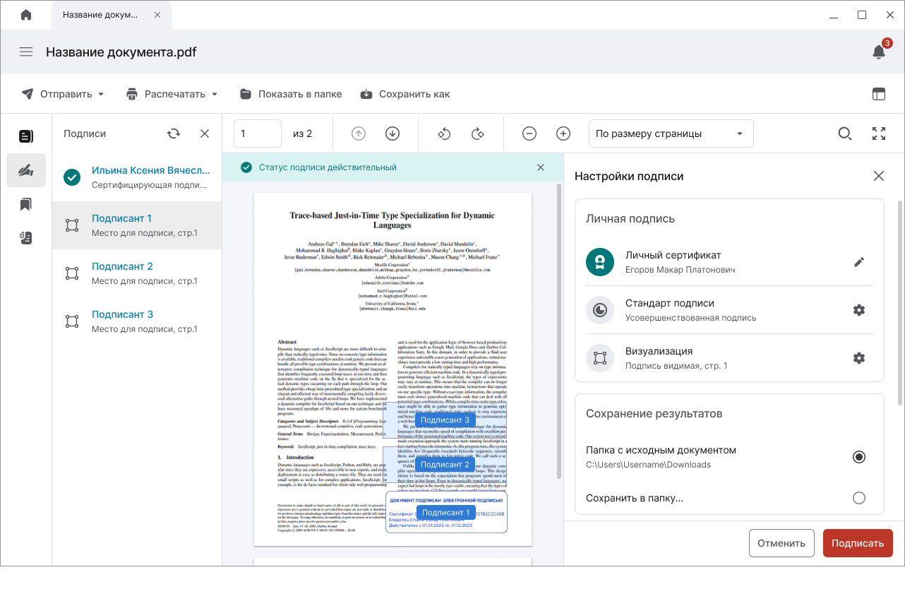

---

## Окно с предварительными настройками

После защиты макета у заказчика, мы решили добавить окошко с предварительными настройками.

После клика на **Подписать**, выводится окно, в котором можно выбрать шаблон настроек и указать настройки областей подписантов.

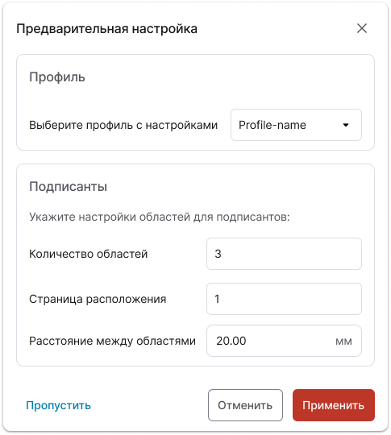

---

## Итог

В результате работы я подготовила полный комплект документов и передала их в разработку. На этапе реализации я курировала проект: отвечала на вопросы команды, помогала уточнять поведение интерфейсов в спорных моментах и вносила корректировки по ходу работы.

Помимо проектирования, я участвовала в тестировании: сравнивала реализованные экраны с макетами, проверяла удобство использования и корректность сценариев. Вместе с командой мы подготовили и проверили 330 тест-кейсов, что позволило выявить и устранить множество ошибок ещё до выхода продукта.