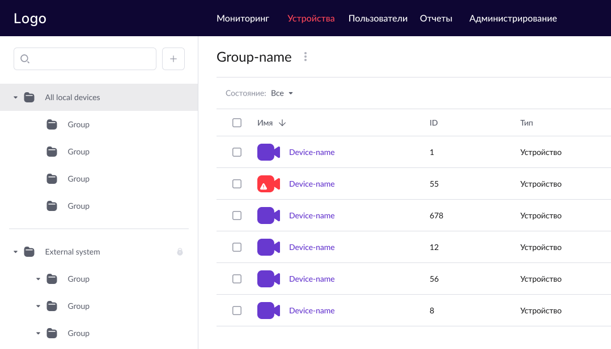
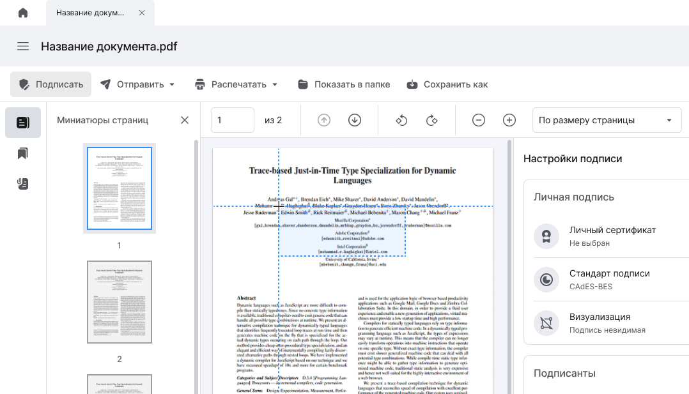

---

hide:
  - navigation
  - toc
  - path
  - footer

glightbox: false

slug: "/post1"
metaTitle: "Обо мне"
sort: "1"

---

<!-- ===== Стили только для этой страницы ===== -->

<!-- ===== Блок "Приветствие" ===== -->

  

    
      Привет! 
      Я Ольга Газизова 👋
    

  

    Начала свою карьеру в IT в роли UX/UI-дизайнера.  
        С 2023 года активно развиваюсь в направлении системного анализа, формулирую функциональные требования и фокусируюсь на создании понятных и качественных продуктов вместе с командой.
  

  <!-- ✅ Ссылки с иконками -->
  

    <a href="https://t.me/OlgaGazizova" target="_blank">
        Телеграм
    </a>

  <a href="mailto:ongazizova@gmail.com">
        Почта
    </a>

  <a href="./images/Газизова Ольга Николаевна.pdf">
        Резюме
    </a>

  

  

  <!--

    
  
-->

<!-- ✅ Заголовок перед карточками -->
<h2 class="section-title">Мои работы</h2>

  <a href="01-case" class="card">
    
    

      <h3>Система управление доступом</h3>
      
Разработка интерфейса для системы управления устройствами и пользователями

    

  </a>

  <a href="02-case" class="card">
    
    

      <h3>Сервис по обзвону должников</h3>
      
Улучшение UI/UX интерфейса сервиса для информирования о задолженности

    

  </a>

  <a href="03-case" class="card">
    
    

      <h3>Приложение для подписи PDF-документов</h3>
      
Разработка требований и интерфейса приложения для подписи документов

    

  </a>

<!-- Вставка кода Яндекс.Метрики -->
<!-- ===== Счетчик Яндекс.Метрики ===== -->

<noscript>

</noscript>
<!-- /Счетчик Яндекс.Метрики -->